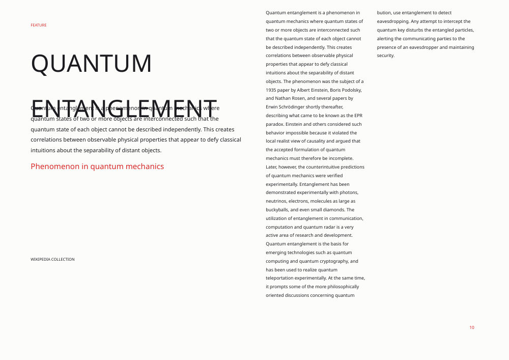
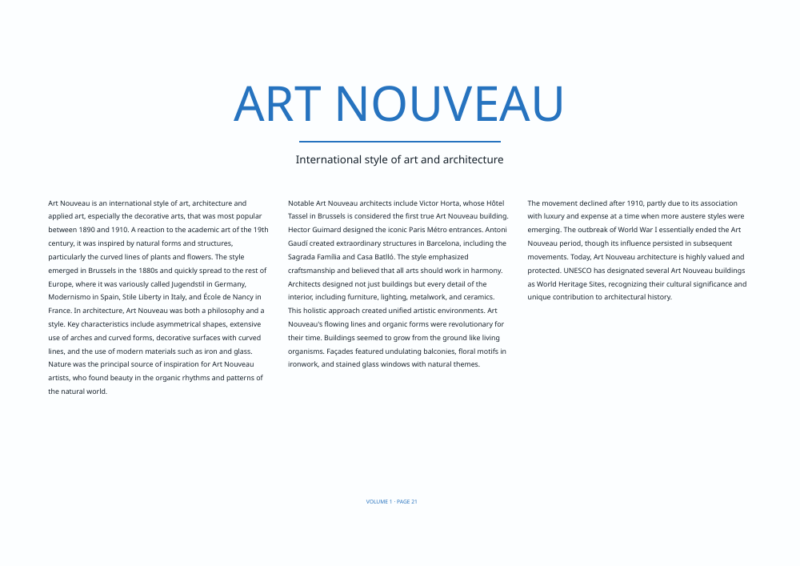
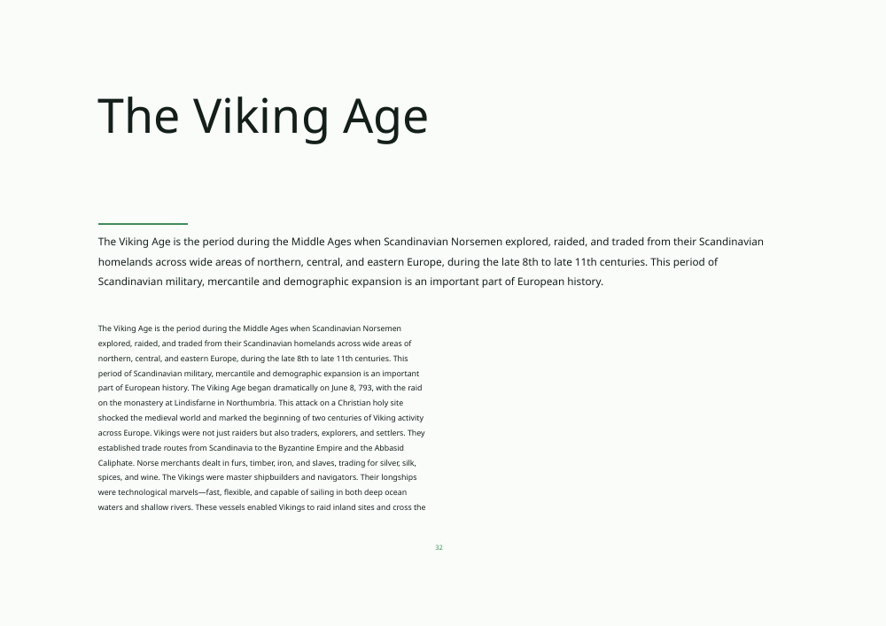
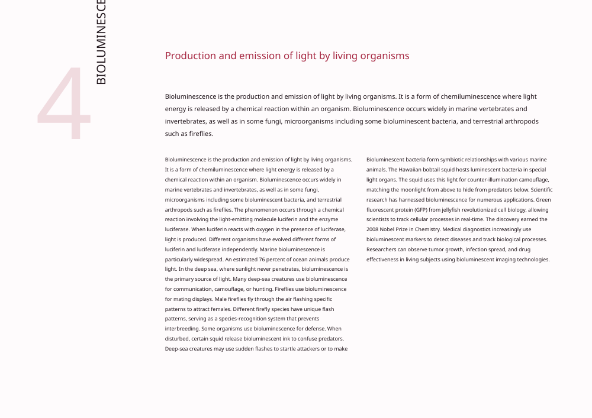
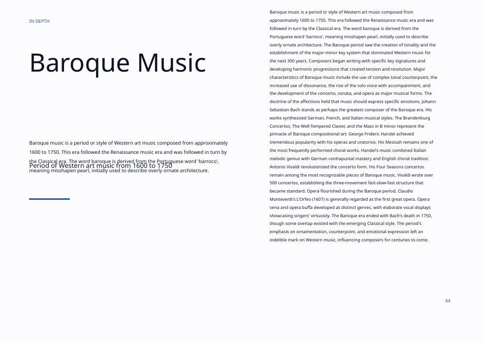
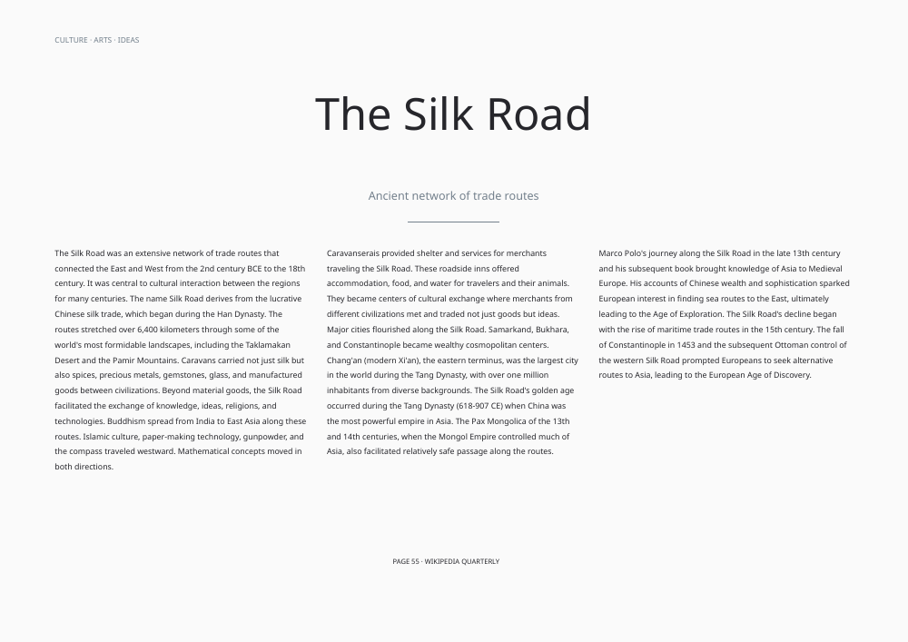
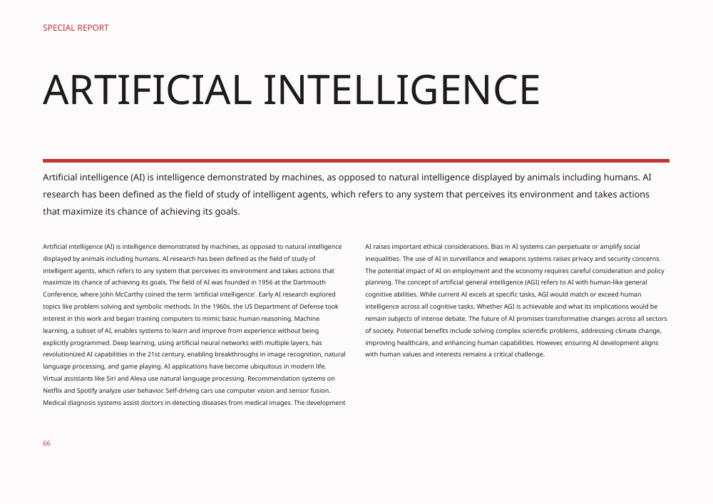
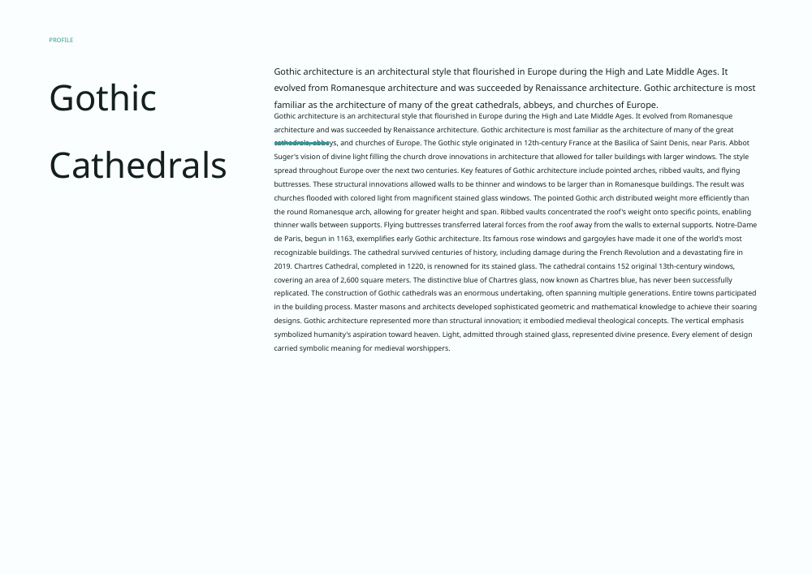
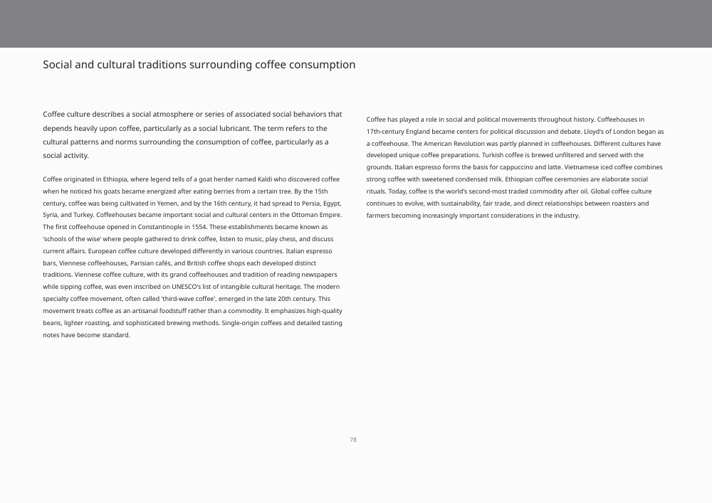
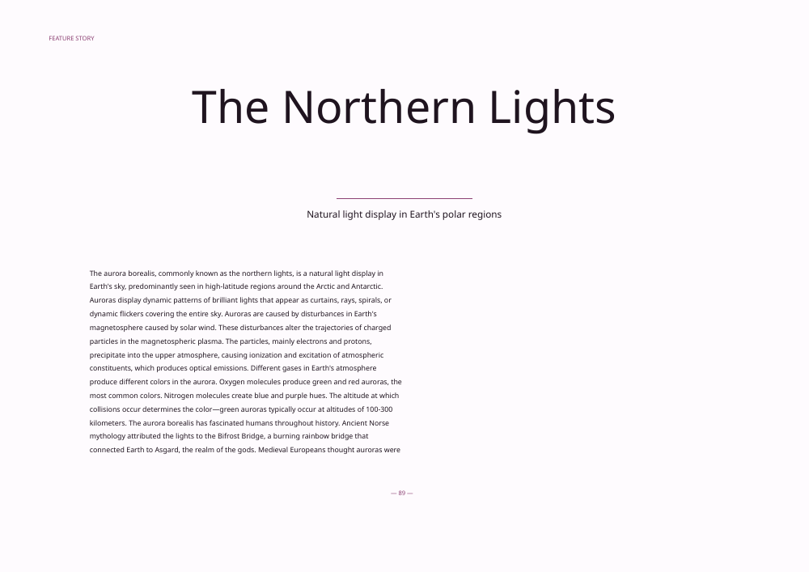

# Wikipedia Magazine Layout Generator

A professional magazine layout generator creating stunning A4 spread designs from Wikipedia content with editorial-quality typography using Google sans-serif fonts.

## 🎨 Overview

This project demonstrates professional editorial design and typesetting practices by generating 10 unique magazine-style PDF layouts. Each layout follows industry-standard typography principles with proper line length (max 75 characters), professional leading, and sophisticated Google font combinations.

## 🖼️ Layout Gallery

### 01. Quantum Entanglement - Editorial Feature

**Style:** Classic magazine editorial • **Fonts:** Roboto Black + Roboto Regular
*Feature article layout with bold title treatment, prominent deck, and dual-column body text. Uses Roboto's multiple weights for hierarchy.*

### 02. Art Nouveau Architecture - News Magazine

**Style:** News magazine (TIME/Newsweek inspired) • **Fonts:** Roboto Bold + Roboto Light
*Centered title treatment with three-column text layout. Clean, authoritative typography with strong horizontal alignment.*

### 03. The Viking Age - Longform Journalism

**Style:** Longform (New Yorker inspired) • **Fonts:** Open Sans Bold + Open Sans Regular
*Elegant serif-alternative approach with generous margins and proper reading columns. Emphasizes readability and sophistication.*

### 04. Bioluminescence - Review Style

**Style:** Review/critique • **Fonts:** Roboto Bold + Roboto Medium
*Dynamic layout with vertical title element and asymmetric column structure. Modern editorial with bold graphic elements.*

### 05. Baroque Music - Feature Spread

**Style:** Classic magazine spread • **Fonts:** Roboto Black + Roboto Light
*Left page for impact with oversized title, right page for reading. Traditional magazine spread format with strong typographic contrast.*

### 06. The Silk Road - Cultural Magazine

**Style:** Cultural arts magazine • **Fonts:** Open Sans Bold + Open Sans Regular
*Centered, elegant approach with three balanced columns. Sophisticated cultural publication aesthetic with refined typography.*

### 07. Artificial Intelligence - Investigative Report

**Style:** Investigative journalism • **Fonts:** Roboto Black + Roboto Regular
*Bold, impactful design with heavy accent elements. Strong typography for serious reporting with prominent header treatment.*

### 08. Gothic Cathedrals - Profile Style

**Style:** Profile/portrait feature • **Fonts:** Open Sans Bold + Open Sans SemiBold
*Asymmetric layout with title sidebar and flowing body text. Editorial portrait style with elegant Open Sans typography.*

### 09. Coffee Culture - Modern Editorial

**Style:** Modern magazine editorial • **Fonts:** Roboto Bold + Roboto Light
*Contemporary design with colored header bar and clean column structure. Modern editorial with strong visual hierarchy.*

### 10. The Northern Lights - Prestige Magazine

**Style:** Prestige (Vogue/Vanity Fair inspired) • **Fonts:** Open Sans Bold + Open Sans Regular
*Refined, elegant design with centered title and sophisticated column layout. High-end magazine aesthetic with minimalist approach.*

## ✨ Features

- **10 Professional Design Styles**: Each inspired by real editorial publications
- **A4 Spread Format**: Two portrait pages side-by-side (1190.56 × 841.89 points)
- **Google Sans-Serif Fonts**: Roboto and Open Sans with multiple weights
- **Proper Typography**:
  - Maximum 75 characters per line for optimal readability
  - Body text: 10.5pt with 14pt leading (1.33 line height)
  - Professional margins: 1" outer, 0.75" inner
  - Proper kerning and letter spacing
- **Editorial Design Principles**: Grid-based layouts, visual hierarchy, balanced whitespace
- **10 Sophisticated Color Palettes**: Classic, Ocean, Forest, Burgundy, Navy, Slate, Crimson, Teal, Charcoal, Plum

## 📐 Typography Standards

### Font Combinations
1. **Roboto Family**: Light, Regular, Medium, Bold, Black
   - Versatile geometric sans-serif
   - Excellent for headlines and body text
   - Clear, modern, highly legible

2. **Open Sans Family**: Regular, SemiBold, Bold
   - Humanist sans-serif with excellent readability
   - Warm, friendly character
   - Perfect for editorial content

### Typographic Principles Applied
- **Optimal Line Length**: 75 characters maximum per line
- **Professional Leading**: 1.33× font size (14pt leading for 10.5pt body)
- **Hierarchy**: Title (48-72pt), Deck (14-20pt), Body (10.5pt), Captions (9pt)
- **Alignment**: Justified body text, left-aligned headlines
- **Margins**: Professional 1-inch margins for print-ready output
- **Kerning**: Automatic optical kerning for professional appearance

## 🎯 Design Styles & Inspirations

| Layout | Style | Inspiration | Key Features |
|--------|-------|-------------|--------------|
| 01 | Editorial Feature | GQ, Esquire | Bold title, dual columns, prominent intro |
| 02 | News Magazine | TIME, Newsweek | Three-column grid, centered title, authoritative |
| 03 | Longform | New Yorker, Atlantic | Generous margins, elegant typography |
| 04 | Review | New York Times Magazine | Asymmetric, dynamic, graphic elements |
| 05 | Feature Spread | Wired, Fast Company | Impact left page, reading right page |
| 06 | Cultural | Artforum, frieze | Centered elegance, balanced columns |
| 07 | Investigative | ProPublica, Guardian Long Read | Bold, serious, heavy typography |
| 08 | Profile | Vanity Fair Profiles | Sidebar title, flowing text |
| 09 | Modern Editorial | Bloomberg Businessweek | Colored header, contemporary |
| 10 | Prestige | Vogue, W Magazine | Refined, centered, minimalist |

## 📚 Featured Articles

Each article showcases different design approaches:
1. **Quantum Entanglement** - Science feature
2. **Art Nouveau Architecture** - Arts & architecture
3. **The Viking Age** - Historical longform
4. **Bioluminescence** - Science review
5. **Baroque Music** - Cultural feature
6. **The Silk Road** - Historical feature
7. **Artificial Intelligence** - Technology investigation
8. **Gothic Cathedrals** - Architecture profile
9. **Coffee Culture** - Lifestyle editorial
10. **The Northern Lights** - Nature feature

## 🛠 Technical Stack

- **DrawBot-skia**: Cross-platform PDF generation
- **Python 3.11**: Core programming
- **Google Fonts**: Roboto, Open Sans, Noto Sans
- **Libraries**: Pillow, Requests, BeautifulSoup4, NumPy
- **Typography Tools**: Custom textBox with proper word wrapping

## 📁 Project Structure

```
.
├── generate_professional_layouts.py  # Professional layout generator
├── text_helpers.py                   # Typography utilities
├── wikipedia_content.json            # Curated content
├── output/                           # Generated PDFs
│   ├── layout_01_Quantum_Entanglement.pdf
│   └── ... (10 professional PDFs)
├── previews/                         # PNG previews
│   ├── layout_01_Quantum_Entanglement-1.png
│   └── ... (10 preview images)
├── wikipedia_magazine_layouts.zip    # Complete archive
└── README.md                         # This file
```

## 🚀 Usage

Generate all professional layouts:

```bash
python3 generate_professional_layouts.py
```

Generates 10 PDF files with proper typography and editorial design.

## 📖 Editorial Design Principles

### Grid Systems
- **Margins**: 72pt (1 inch) outer/top/bottom, 54pt (0.75 inch) inner
- **Columns**: 2-3 columns with 24-36pt gutters
- **Baseline Grid**: 14pt for consistent vertical rhythm

### Typography Hierarchy
1. **Display/Title**: 48-72pt bold/black weights
2. **Deck/Subtitle**: 14-20pt light/regular weights
3. **Body Text**: 10.5pt regular weight, 14pt leading
4. **Captions**: 9pt, reduced leading
5. **Labels**: 8-11pt, uppercase, bold

### Color Usage
- **Primary Text**: Near-black (10-15% gray)
- **Accent Colors**: Restrained, purposeful
- **Background**: Off-white (98-99% white)
- **Contrast Ratio**: Minimum 7:1 for accessibility

### Whitespace Management
- Generous margins for breathing room
- Consistent paragraph spacing
- Strategic use of negative space
- Never cramped or overcrowded

## 💡 Professional Practices

### Readability Optimization
- **75 Characters per Line**: Optimal for comfortable reading
- **1.33 Line Height**: Industry standard for body text
- **Justified Text**: Professional magazine standard
- **Widow/Orphan Control**: Careful text flow management

### Print-Ready Output
- **Vector PDFs**: Scalable, print-quality output
- **Proper Margins**: Bleed-ready with standard margins
- **Professional Fonts**: Licensed Google Fonts
- **Color Mode**: RGB (easily convertible to CMYK)

## 🎓 Educational Value

Demonstrates mastery of:
- **Editorial Design**: Professional magazine layout principles
- **Typography**: Proper typesetting and font usage
- **Grid Systems**: Structured layout frameworks
- **Visual Hierarchy**: Clear information architecture
- **Color Theory**: Sophisticated palette selection
- **Programmatic Design**: Automated yet beautiful output

## 📊 Output Specifications

- **Format**: PDF (print-ready)
- **Size**: A4 Spread (420mm × 297mm)
- **Orientation**: Two portrait pages side-by-side
- **Resolution**: 72 DPI (vector graphics)
- **File Size**: ~20-27 KB per layout
- **Preview Size**: ~70-140 KB per PNG (1000px wide)

## 🏆 Results

Successfully generated:
- **10 PDF Layouts** (~240KB total) - Editorial-quality professional designs
- **10 PNG Previews** (~1MB total) - High-resolution preview images
- **Complete ZIP Archive** (~222KB) - All PDFs bundled

Each layout demonstrates professional magazine design with proper typography, balanced composition, and editorial excellence.

## 🔧 Dependencies

### Python Packages
```bash
pip3 install drawbot-skia pillow requests beautifulsoup4 lxml
```

### System Fonts
```bash
apt-get install fonts-roboto fonts-open-sans fonts-noto
```

### PDF Tools
```bash
apt-get install poppler-utils imagemagick
```

---

**Professional Editorial Design** • **Created with DrawBot-skia** • **2026**
